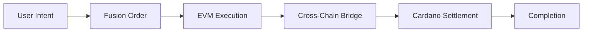

# 1inch Fusion Integration Analysis

## Key Finding: Ronakgupta11's CardanoSwap is not currently using 1inch fusion

The CardanoSwap implementation **does not use** 1inch Fusion or Fusion+. Instead, it implements a **custom LimitOrderProtocol** that borrows architectural patterns from 1inch but operates independently.

## Evidence Analysis

### 1. Custom LimitOrderProtocol Implementation

**File**: `contracts/evm/contracts/LimitOrderProtocol.sol`

```solidity
// Custom implementation - NOT official 1inch Fusion
contract LimitOrderProtocol is EIP712, Ownable {
    using SafeERC20 for IERC20;

    // Track validated orders to prevent replay attacks
    mapping(bytes32 => bool) public validatedOrders;

    // Store order details for validated orders
    mapping(bytes32 => IAtomicSwapLOP.Order) public orders;

    /**
     * @notice Phase 1: Called by the maker to validate their order and provide ETH if needed
     */
    function preInteraction(
        IAtomicSwapLOP.Order calldata order,
        bytes calldata signature
    ) external payable {
        // Custom atomic swap logic - NOT Fusion Dutch auction
        // EIP-712 signature validation
        // Order storage for two-phase execution
    }

    /**
     * @notice Phase 2: Called by the resolver to transfer funds from LOP to escrow
     */
    function postInteraction(
        bytes32 orderHash,
        address factory,
        uint256 safetyDeposit
    ) external {
        // Custom escrow deployment logic - NOT Fusion settlement
    }
}
```

### 2. Missing Fusion Core Features

#### No Dutch Auction Mechanism
**Real Fusion**: Orders start at higher price and decrease over time
**CardanoSwap**: Fixed price orders with no time-based pricing

```solidity
// MISSING: Dutch auction logic
// MISSING: Time-based rate improvement
// MISSING: Competitive pricing discovery
```

#### No Resolver Competition
**Real Fusion**: Multiple resolvers compete for best execution
**CardanoSwap**: Single resolver accepts order manually

```javascript
// backend/controllers/ordersController.js:44-52
const acceptOrder = async (req, res) => {
  try {
    // Single resolver acceptance - NO competition
    const result = await orderService.acceptOrder(req.params.id, req.body.resolverAddress);
    res.json(result.data);
  } catch (error) {
    handleServiceError(error, res);
  }
};
```

#### No Cross-Chain Routing
**Real Fusion+**: Cross-chain swaps through 1inch network
**CardanoSwap**: Manual cross-chain coordination

### 3. Order Structure Comparison

#### CardanoSwap Custom Order
```solidity
// contracts/evm/contracts/interfaces/IAtomicSwapLOP.sol:9-18
struct Order {
    address maker;
    address makerAsset;
    address takerAsset;
    uint256 makingAmount;
    uint256 takingAmount;
    address receiver;
    bytes32 hashlock;     // Custom addition for atomic swaps
    uint256 salt;
}
```

#### Real 1inch Fusion Order Structure
```solidity
// Missing: Dutch auction parameters
// Missing: Deadline and rate curves
// Missing: Fusion-specific routing data
// Added: hashlock for atomic swap coordination
```

### 4. Deployment Configuration Evidence

**File**: `frontend/lib/constants.ts:7-16`

```typescript
const ADDRESSES = {
  "network": "sepolia",
  "chainId": 11155111,
  "accessToken": "0xfE31A69264fec44007Fece974E005fD3145E62C5",
  "cardanoEscrowFactory": "0x93645a4F513B846f4F1A3A66dd72Ad1fae4dB0fC",
  "limitOrderProtocol": "0x5ce0524525EaB2f570D37FDE4cDD2fAf40629cAF", // Custom deployment
  // NO official 1inch Fusion addresses
};
```

### 5. Borrowed 1inch Infrastructure Only

#### Library Usage (1inch Patterns)
- **AddressLib.sol**: Gas optimization type wrapper
- **TimelocksLib.sol**: Compact timelock storage
- **ImmutablesLib.sol**: Efficient hashing with assembly
- **ProxyHashLib.sol**: CREATE2 deployment patterns

```solidity
// contracts/evm/contracts/libraries/AddressLib.sol:6-7
/**
 * @title Address type for 1inch contracts
 * @notice Utility library for Address type operations
 */
```

#### Security Annotations Preserved
```solidity
// Multiple files contain:
// @custom:security-contact security@1inch.io
```

## What 1inch Fusion Integration Would Provide

### 1. Dutch Auction Pricing
```javascript
// Theoretical Fusion integration
const fusionOrder = {
  // Time-based rate improvement
  startRate: "1000000", // Starting rate
  endRate: "950000",    // Final rate after auction period
  duration: 300,        // 5 minute auction
  // Automatic price discovery
};
```

### 2. Resolver Network Competition
```javascript
// Multiple resolvers competing
const bestExecution = await fusionNetwork.findBestResolver({
  order: crossChainOrder,
  chains: ["ethereum", "cardano"],
  // Automatic routing and rate optimization
});
```

### 3. Cross-Chain Routing
```javascript
// Real Fusion+ would handle:
// - Cross-chain liquidity aggregation
// - Automated bridging
// - Multi-hop routing optimization
```

## Why Not Using Official Fusion?

### Technical Limitations

1. **Cross-Chain Scope**: Fusion operates within EVM ecosystems
2. **HTLC Requirements**: Atomic swaps need secret-based coordination
3. **Time Synchronization**: Different finality models between chains
4. **Custom Settlement**: Requires specialized escrow contracts

### Implementation Approach

Instead of extending Fusion, CardanoSwap:
- **Mimics** 1inch's order management patterns
- **Borrows** gas optimization techniques
- **Implements** custom atomic swap logic
- **Operates** independently of 1inch network

## Integration Potential

### Possible Fusion Integration Path



#### Requirements for Real Integration
1. **Fusion order wrapper** for cross-chain intents
2. **Resolver bridge integration** with Cardano coordination
3. **Rate discovery** through Fusion's auction mechanism
4. **Settlement coordination** between Fusion and Cardano escrows

## Conclusion

CardanoSwap is a **standalone atomic swap system** that:
- ✅ Uses 1inch's proven architectural patterns
- ✅ Borrows gas optimization techniques
- ✅ Follows 1inch's security practices
- ❌ Does NOT use actual Fusion/Fusion+ protocols
- ❌ Does NOT connect to 1inch's resolver network
- ❌ Does NOT provide Dutch auction pricing

**Status**: Independent implementation inspired by 1inch, not an extension of Fusion.